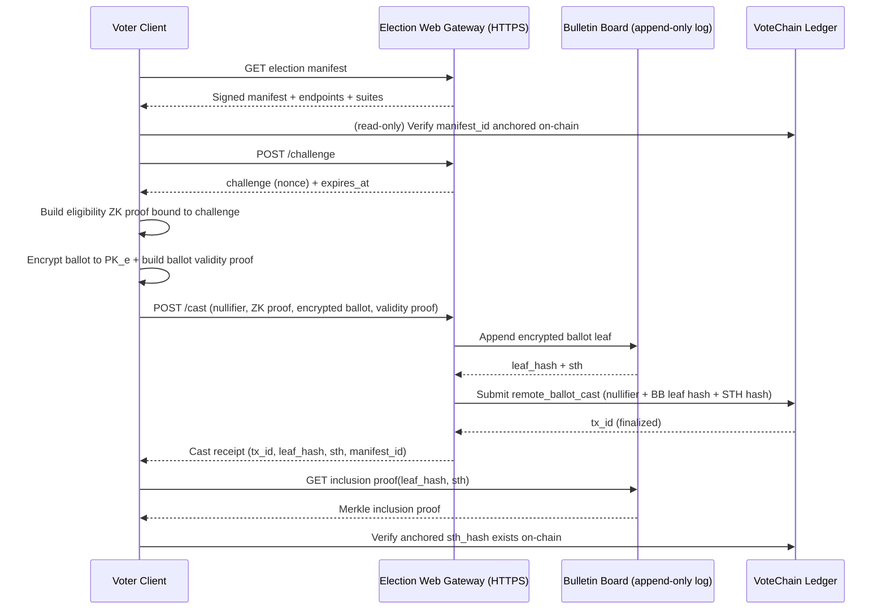

# PRD: VoteChain Election Web Protocol (EWP) - Remote Ballot Casting Profile (Preview)

> Status: **Preview / Draft (EWP/0.1)**  
> Date: 2026-02-08  
> Scope: Optional remote-casting track that layers on top of **VoteChain** voter verification.  
> Non-claim: This document is not an endorsement of immediate nationwide Internet voting. It is a buildable protocol profile intended for controlled pilots, red teaming, and standards work (NIST/EAC/CISA + external review).

## 0. Relationship To The VoteChain PRD

This protocol is designed to integrate with the existing VoteChain blueprint in `PRD-VOTER-VERIFICATION-CHAIN.md`.

VoteChain (as defined there) answers four questions and records verification events on a permissioned ledger:

1. Citizen?
2. Eligible (for this jurisdiction + election)?
3. Alive / liveness satisfied?
4. Already voted (nullifier uniqueness)?

**EWP** adds a remote-casting "ballot transport + public verifiability" layer while keeping the VoteChain invariants:

- No PII on-chain.
- Ballot secrecy is preserved: VoteChain learns *that* you voted (or attempted), not *how* you voted.
- One-person-one-vote enforcement is anchored on VoteChain via a per-election **nullifier**.

## 1. Goals And Non-Goals

### 1.1 Goals

- **G1: Eligibility without identity disclosure.** A voter proves eligibility for `election_id` + `jurisdiction_id` without revealing who they are.
- **G2: Ballot secrecy.** No single gateway operator can learn vote selections from protocol transcripts.
- **G3: End-to-end verifiability (E2E-V).** Voters and auditors can verify:
  - (a) their encrypted ballot was recorded (inclusion), and
  - (b) the final tally corresponds to the recorded encrypted ballots (counted-as-recorded).
- **G4: Anti-replay + anti-duplication.** Prevent replay of cast requests; prevent counting more than one ballot per eligible credential per election (with optional revoting extension).
- **G5: Transparency without a public blockchain.** Use a public bulletin board (append-only log) whose signed checkpoints are anchored into VoteChain.
- **G6: Interoperability.** Provide an HTTP(S) profile with explicit message schemas, versioning, and algorithm agility.

### 1.2 Non-Goals (Explicit)

- **NG1: Perfect coercion resistance in hostile home environments.** Remote casting cannot fully prevent coercion and device malware. EWP defines mitigations and a "safe override" model, not magic.
- **NG2: Replacing in-person voting.** The default and most robust path remains in-person with a physical ballot.
- **NG3: A single nationwide implementation.** The protocol is a profile; implementations may vary as long as they pass conformance requirements.
- **NG4: Storing ballots on VoteChain.** Only *commitments/hashes* and audit anchors belong on the chain; ciphertext storage is off-chain in an append-only bulletin board.

## 2. Threat Model (What We Defend Against)

### 2.1 Adversaries

- **A1: Network attacker** (MITM, replay, traffic analysis).
- **A2: Malicious or compromised gateway** (drops ballots, serves different manifests, attempts to correlate voters, attempts to accept invalid ballots).
- **A3: Insider operator** (key theft, log manipulation, selective suppression).
- **A4: Malicious voter** (double-vote attempts, malformed ballots).
- **A5: Coercer** (demands vote proof; observes voter while voting).
- **A6: Client malware** (modifies selections before encryption; steals credentials).
- **A7: Trustee compromise** (tries to decrypt individual ballots).

### 2.2 Security Properties Claimed (And Boundaries)

EWP targets these properties under explicit assumptions:

- **P1: Eligibility soundness.** Only holders of valid VoteChain credentials can produce an accepted cast.
- **P2: Uniqueness.** At most one ballot per (credential, election) is *counted* (strict mode) or *final* (revoting extension).
- **P3: Ballot privacy.** If fewer than `t` trustees collude (threshold model), no party learns individual votes.
- **P4: Recorded-as-cast.** Voter can verify their ballot ciphertext appears on the bulletin board (BB) and is anchored on VoteChain.
- **P5: Counted-as-recorded.** Anyone can verify that the published tally is computed from the set of BB-recorded ballots.
- **P6: Non-equivocation of the BB.** A BB operator cannot present inconsistent views without detection by monitors.

Not claimed:

- Full coercion resistance against A5 + A6 in uncontrolled environments.

## 3. Actors And Trust Boundaries

### 3.1 Actors

- **Voter Client (VC):** Browser app or native app (or kiosk for controlled pilots).
- **VoteChain Credential (VCC):** Voter-held private material enabling eligibility ZK proofs (as defined in the VoteChain PRD).
- **Election Web Gateway (EWG):** HTTPS API that accepts proofs, validates ballots, and writes audit anchors to VoteChain.
- **Bulletin Board (BB):** Public append-only log of encrypted ballots and election artifacts.
- **Trustees / Guardians (T[1..n]):** Threshold key holders for tally decryption.
- **VoteChain Ledger (VCL):** Permissioned consortium chain used as an audit anchor and nullifier uniqueness oracle.
- **Monitors (MON):** Independent parties that watch BB and VCL for equivocation or missing artifacts.

### 3.2 Separation (Privacy By Design)

To reduce correlation risk, EWP assumes **logical separation** between:

- The **eligibility proof** plane (VoteChain credential and its ZK proof), and
- The **ballot content** plane (encrypted ballot, BB publication, tally proofs).

Even if a gateway sees both, it must not learn vote content because ballots are encrypted under a **threshold election key**.

## 4. Crypto Building Blocks (Protocol Primitives)

This section defines the cryptographic objects EWP transports over HTTPS. Implementations may choose concrete algorithms as long as they satisfy the same interfaces and publish suites.

### 4.1 Hashes And Encoding

- Hash function: `SHA-256` (default), with algorithm agility.
- Bytes encoding in JSON: `base64url` without padding.
- Canonical JSON for signing: **JCS** (RFC 8785).

### 4.2 Nullifier (Duplicate Prevention Anchor)

Per VoteChain PRD, each voter has a deterministic per-election nullifier:

```
nullifier = H("votechain:nullifier:v1" || did_pubkey || election_id)
```

Requirements:

- Collision-resistant under `H`.
- The voter can prove in ZK that `nullifier` is correctly derived from their credential.
- VoteChain (or gateways querying it) can check if `nullifier` has already been used.

### 4.3 Eligibility Proof (ZK)

EWP reuses the VoteChain "five-pillar" ZK proof concept. For remote casting, the proof MUST additionally bind to a server-provided **challenge** to prevent replay.

Public inputs (minimum):

- `election_id`
- `jurisdiction_id`
- `nullifier`
- `challenge` (nonce from EWG)
- `timestamp` (optional; for freshness windows)

Remote-casting liveness requirement:

- The proof MUST assert that a liveness factor was satisfied within a bounded freshness window (for example: <= 5 minutes) as defined by the election manifest policy.
- The liveness factor MAY be biometric or non-biometric (per the VoteChain PRD), but the proof MUST NOT reveal which path was used.

Outputs:

- Proof bytes `pi`
- Proof system identifier `zk_suite`
- Verifying-key identifier `vk_id`

Verifier checks:

- Proof verifies for public inputs
- `nullifier` unused on VoteChain (strict mode), or follows revoting rules (extension)
- Credential not revoked (VoteChain revocation events)

### 4.4 Encrypted Ballot (E2E Verifiable)

EWP transports **encrypted ballots** plus a **ballot validity proof**:

- Ciphertext is encrypted under an election public key `PK_e` whose private key is split among trustees.
- Ballot validity proof demonstrates the ciphertext encodes a legally-formed ballot for the manifest (e.g., no overvotes) without revealing selections.

EWP is compatible with:

- Homomorphic tallying (e.g., exponential ElGamal or Paillier + ZK proofs), or
- Mixnet/shuffle + re-encryption + ZK proofs.

This document provides a baseline interface; the concrete cryptosystem is a "suite."

### 4.5 Bulletin Board Transparency (Merkle Log)

BB acts like a transparency log:

- Each submitted artifact becomes a leaf in an append-only Merkle tree.
- BB periodically publishes a **Signed Tree Head** (STH): `(tree_size, root_hash, timestamp, signature)`.
- STHs are **anchored to VoteChain** so equivocation is detectable.

### 4.6 Crypto Suite: `ewp_suite_eg_elgamal_v1` (Baseline Profile)

This suite is intended as a concrete, buildable baseline compatible with well-studied E2E schemes
(Helios/ElectionGuard-style design patterns). It is not the only acceptable suite.

Suite identifiers:

- `ewp_suite_eg_elgamal_v1` (this section)

#### 4.6.1 Group And Parameters

Let `G` be a prime-order group of order `q` with generator `g`. The manifest MUST specify:

- a group identifier from an allowlist (example: `modp_3072`, `ristretto255`, etc.)
- `q` and `g` (or a named curve / group ID that implies them)

Implementations MUST reject unknown or non-allowlisted groups.

#### 4.6.2 Election Key

Election public key:

- Secret `x in Z_q`
- Public key `PK_e = g^x`

`x` is split among trustees using a threshold scheme; no single party holds `x`.

#### 4.6.3 Exponential ElGamal (Selection Encryption)

Encode a selection value `m` as `g^m` where `m` is in a small domain (typically `m in {0,1}`).

Encryption with randomness `r in Z_q`:

- `a = g^r`
- `b = PK_e^r * g^m`

Ciphertext is `(a,b)`.

For multi-contest ballots, encrypt each selection independently. (Batching/aggregation is an implementation detail.)

#### 4.6.4 Ballot Validity Proofs

Ballot validity proofs MUST convince verifiers that:

- Each selection is in-range (for 1-of-n contests: each selection is 0 or 1).
- The contest constraint is satisfied (e.g., sum of selections <= `k`).
- The ciphertexts correspond to the manifest (contest IDs, option IDs).

This suite uses non-interactive zero-knowledge proofs derived from sigma protocols via Fiat-Shamir,
for example:

- Disjunctive Chaum-Pedersen proofs to show `m in {0,1}` without revealing `m`.
- Additional proofs to show contest constraints (depending on ballot type).

The suite MUST define a deterministic transcript hash input to Fiat-Shamir:

```
FS = H("ewp:fs:v1" || election_id || manifest_id || contest_id || ciphertexts || context)
```

#### 4.6.5 Homomorphic Tally

For each selection, ciphertexts multiply to an encryption of the sum:

- `A = product_i a_i = g^(sum r_i)`
- `B = product_i b_i = PK_e^(sum r_i) * g^(sum m_i)`

Trustees jointly decrypt `B / A^x = g^(sum m_i)` and recover `sum m_i` (in a bounded domain).

Trustees MUST publish decryption proofs (e.g., Chaum-Pedersen) for their partial decryptions so anyone can verify tally correctness.

#### 4.6.6 Encoding For HTTP Transport

To avoid JSON canonicalization footguns for large algebraic objects:

- `encrypted_ballot.ciphertext` SHOULD be a deterministic CBOR encoding of the ciphertext structure, then `base64url`.
- `ballot_validity_proof` SHOULD be deterministic CBOR, then `base64url`.

JSON-only encodings are permitted for prototypes but SHOULD NOT be the long-term standard.

## 5. Protocol Overview (Happy Path)



## 6. HTTP(S) Profile

### 6.1 Transport Requirements

- HTTPS required (TLS 1.3 recommended).
- Gateways MUST support HTTP/2; HTTP/3 recommended.
- All responses MUST include `Cache-Control` appropriate to content:
  - Manifests can be cached.
  - Challenges and receipts must not be cached (`no-store`).

### 6.2 Versioning

- Clients send `Accept: application/votechain.ewp.v1+json`.
- Servers respond `Content-Type: application/votechain.ewp.v1+json`.
- Major version bump for breaking changes.

### 6.3 Discovery

`GET /.well-known/votechain-ewp`

Response:
```json
{
  "ewp_version": "0.1-preview",
  "issuer": "ewp.example.gov",
  "elections_url": "https://ewp.example.gov/v1/elections",
  "jwks_url": "https://ewp.example.gov/.well-known/jwks.json",
  "supported_suites": ["ewp_suite_eg_elgamal_v1"],
  "bb_base_url": "https://bb.example.gov/v1",
  "votechain_read_api": "https://votechain-read.example.gov/v1"
}
```

### 6.4 Election Manifest

`GET /v1/elections/{election_id}/manifest`

The manifest is a signed object (JCS-canonicalized JSON + signature) that binds:

- election parameters
- ballot styles and contest definitions (or pointers)
- cryptographic parameters (trustees, `PK_e`, proof suites, BB endpoints)
- allowed gateways and their signing keys

Minimum fields:

```json
{
  "election_id": "2026-general-federal",
  "jurisdiction_id": "state_hash_0x9c1d",
  "manifest_id": "b64u(sha256(canonical_manifest))",
  "not_before": "2026-10-01T00:00:00Z",
  "not_after": "2026-11-04T12:00:00Z",
  "crypto": {
    "suite": "ewp_suite_eg_elgamal_v1",
    "pk_election": "b64u(...)",
    "trustees": [
      { "id": "T1", "pubkey": "b64u(...)" },
      { "id": "T2", "pubkey": "b64u(...)" }
    ],
    "threshold": { "t": 3, "n": 5 }
  },
  "endpoints": {
    "challenge": "https://ewp.example.gov/v1/elections/2026-general-federal/challenge",
    "cast": "https://ewp.example.gov/v1/elections/2026-general-federal/cast",
    "bb": "https://bb.example.gov/v1/elections/2026-general-federal"
  },
  "signing": {
    "alg": "Ed25519",
    "kid": "manifest-key-2026",
    "sig": "b64u(...)"
  }
}
```

**VoteChain anchoring requirement:** `manifest_id` MUST be published on VoteChain before `not_before` as an `election_manifest_published` event so clients can verify they are seeing the canonical election definition.

### 6.5 Challenge (Anti-Replay)

`POST /v1/elections/{election_id}/challenge`

Request:
```json
{
  "client_session": "b64u(32_random_bytes)"
}
```

Response:
```json
{
  "challenge_id": "b64u(16_random_bytes)",
  "challenge": "b64u(32_random_bytes)",
  "expires_at": "2026-11-03T15:04:05Z",
  "server_sig": "b64u(...)"
}
```

Rules:

- Challenge lifetime SHOULD be short (e.g., 2-5 minutes).
- Eligibility ZK proof MUST include `challenge` as a public input.
- EWG MUST reject casts with expired challenges.

### 6.6 Cast

`POST /v1/elections/{election_id}/cast`

Headers:

- `Idempotency-Key: <uuid>` (required)

Idempotency rules:

- If a client retries with the same `Idempotency-Key`, the gateway MUST return the same outcome (same receipt or same terminal error) as long as the request body is identical.
- If the request body differs for a reused `Idempotency-Key`, the gateway MUST return `409 Conflict` with `EWP_IDEMPOTENCY_MISMATCH`.

Request:
```json
{
  "ewp_version": "0.1-preview",
  "election_id": "2026-general-federal",
  "jurisdiction_id": "state_hash_0x9c1d",
  "manifest_id": "b64u(...)",

  "challenge_id": "b64u(...)",
  "challenge": "b64u(...)",

  "nullifier": "0x....",
  "eligibility_proof": {
    "zk_suite": "votechain_zk_v1",
    "vk_id": "vk_2026_11",
    "public_inputs": {
      "election_id": "2026-general-federal",
      "jurisdiction_id": "state_hash_0x9c1d",
      "nullifier": "0x....",
      "challenge": "b64u(...)"
    },
    "pi": "b64u(...)"
  },

  "encrypted_ballot": {
    "ballot_id": "b64u(16_random_bytes)",
    "ciphertext": "b64u(...)",
    "ballot_validity_proof": "b64u(...)",
    "ballot_hash": "b64u(sha256(...))"
  }
}
```

Response (success):
```json
{
  "status": "cast_recorded",
  "cast_receipt": {
    "receipt_id": "b64u(...)",
    "election_id": "2026-general-federal",
    "manifest_id": "b64u(...)",
    "ballot_hash": "b64u(...)",
    "bb_leaf_hash": "b64u(...)",
    "bb_sth": {
      "tree_size": 123456,
      "root_hash": "b64u(...)",
      "timestamp": "2026-11-03T15:02:01Z",
      "sig": "b64u(...)"
    },
    "votechain_anchor": {
      "tx_id": "0x...",
      "event_type": "remote_ballot_cast",
      "sth_root_hash": "b64u(...)"
    },
    "sig": "b64u(...)"
  }
}
```

Response (accepted, async):
```json
{
  "status": "cast_pending",
  "cast_id": "b64u(...)",
  "poll_url": "https://ewp.example.gov/v1/elections/2026-general-federal/casts/b64u(...)"
}
```

#### 6.6.1 Error Responses

All error responses MUST be JSON and MUST use a stable machine-readable code:

```json
{
  "error": {
    "code": "EWP_PROOF_INVALID",
    "message": "Eligibility proof failed verification.",
    "retryable": false,
    "details": {
      "vk_id": "vk_2026_11"
    }
  }
}
```

HTTP status code mapping (minimum):

- `400` invalid request schema
- `401` missing/invalid auth where applicable (typically not used for anonymous cast flows)
- `403` credential revoked or not eligible (policy-dependent)
- `409` nullifier used, idempotency mismatch
- `429` rate limited (MUST include `Retry-After`)
- `503` overloaded (MUST include alternate gateways if known)

### 6.7 Cast Status (If Async)

`GET /v1/elections/{election_id}/casts/{cast_id}`

Returns either `cast_pending` or `cast_recorded` with a full receipt.

### 6.8 Bulletin Board API (Minimum)

The BB is logically separate from EWG (may be same operator but separate keying).

- `GET /v1/elections/{election_id}/sth` -> returns latest STH
- `GET /v1/elections/{election_id}/leaves/{bb_leaf_hash}` -> returns leaf payload (encrypted ballot artifact)
- `GET /v1/elections/{election_id}/proof/{bb_leaf_hash}?root=<root_hash>` -> returns Merkle inclusion proof for a particular STH root

### 6.9 Tally Publication

At election close, trustees publish:

- the set commitment (BB STH root at close)
- tally artifact (aggregate ciphertext or mixnet outputs)
- decryption proofs / shuffle proofs

Endpoints:

- `GET /v1/elections/{election_id}/tally` -> signed tally object
- `GET /v1/elections/{election_id}/tally/proofs` -> ZK proofs needed for verification

VoteChain anchoring requirement:

- BB closing STH root MUST be anchored on VoteChain as `bb_close_sth_published`.
- Tally commitment MUST be anchored on VoteChain as `tally_published`.

## 7. On-Chain Events (VoteChain Anchors)

EWP assumes VoteChain chaincode enforces the critical invariants. New event types:

### 7.1 `election_manifest_published`

Published prior to voting. Payload includes `manifest_id` and signer.

### 7.2 `remote_ballot_cast`

Written when a cast is accepted and recorded.

Minimum payload:

```json
{
  "type": "remote_ballot_cast",
  "election_id": "2026-general-federal",
  "jurisdiction_id": "state_hash_0x9c1d",
  "nullifier": "0x....",
  "ballot_hash": "b64u(...)",
  "bb_leaf_hash": "b64u(...)",
  "bb_root_hash": "b64u(...)",
  "gateway_id": "ewg_17",
  "recorded_at": "2026-11-03T15:02:01Z"
}
```

Chaincode MUST enforce:

- `manifest_id` is valid and published.
- `nullifier` unused (strict mode), or revoting rules (extension).
- `bb_root_hash` matches a BB STH signature from an authorized BB key (or is later anchored).

### 7.3 `bb_sth_published`

Periodically anchors BB STH roots on VoteChain to prevent equivocation.

### 7.4 `tally_published`

Anchors the final tally artifact hash and proof bundle hashes.

## 8. Security Proof Sketch (Why This Works)

This is a "proof outline" that the protocol reduces its claims to standard crypto assumptions.

### 8.1 Eligibility Soundness (P1)

Claim: An adversary cannot cause a counted cast without holding a valid credential.

Reduces to:

- Unforgeability of the VoteChain credential signature scheme, and
- Soundness of the ZK proof system: a verifier accepts only if the prover knows a valid witness (credential) satisfying the five pillars and the `nullifier` derivation.

Replay protection comes from the server-issued `challenge` included as a public input. A captured proof from one session cannot be replayed under a different challenge.

### 8.2 Uniqueness (P2)

Strict mode: chaincode rejects any second `remote_ballot_cast` with the same `nullifier`.

Reduces to:

- Collision resistance of `H` (nullifier collisions are negligible), and
- VoteChain consensus safety and chaincode correctness for the uniqueness check.

### 8.3 Ballot Privacy (P3)

Claim: No party learns vote selections from protocol traffic.

Reduces to:

- IND-CPA security of the ballot encryption scheme under `PK_e`, and
- Threshold security assumption: fewer than `t` trustees collude (or trustees use MPC such that decryption requires `t` shares).

Gateways see ciphertext, not plaintext.

### 8.4 Recorded-As-Cast (P4)

Claim: Voter can verify their ballot ciphertext was recorded in the public log.

Mechanism:

- Receipt includes `bb_leaf_hash` and a BB STH (`root_hash`).
- BB provides a Merkle inclusion proof that `bb_leaf_hash` is in `root_hash`.
- VoteChain anchoring publishes `root_hash` so a BB cannot later rewrite history undetected.

Reduces to:

- Collision resistance of Merkle hashing,
- Signature unforgeability of BB STH signing keys,
- VoteChain anchoring integrity (consensus safety).

### 8.5 Counted-As-Recorded (P5)

Claim: Anyone can verify the published tally corresponds to the recorded ballots.

Mechanism:

- The tally references the BB closing STH root at election close.
- Trustees publish decryption/shuffle proofs.
- Auditors verify proofs against the set of recorded ciphertexts.

Reduces to:

- Soundness of the tally proof system (mixnet proofs or homomorphic decryption proofs),
- Correctness of the BB set commitment (STH root) and anchoring.

### 8.6 Non-Equivocation (P6)

Claim: BB cannot show different logs to different users without detection.

Mechanism:

- BB STH roots are anchored on VoteChain.
- Monitors gossip STHs and check consistency proofs.

Reduces to:

- Signature unforgeability and monitor coverage.

## 9. Coercion, Receipt-Freeness, And Mitigations

Remote casting is vulnerable to coercion and client malware. EWP therefore treats remote casting as a **constrained pilot profile** with explicit mitigations:

- **M1: Revoting extension (optional):** allow multiple casts; only the last valid cast before close is counted. This reduces coercion but does not eliminate it.
- **M2: In-person override:** a verified in-person ballot can override any remote cast (jurisdiction policy), with an on-chain audit trail.
- **M3: Controlled environments first:** UOCAVA, supervised kiosks, or consular/base voting rooms before general unsupervised home voting.
- **M4: Challenge/spoil auditing (optional):** allow voters to generate "test ballots" that are decrypted immediately (and not counted) to audit client correctness. This deters large-scale client-side manipulation when combined with randomized selection.

The protocol intentionally avoids giving the voter a receipt that proves vote selections; receipts only prove inclusion of an encrypted artifact.

## 10. Implementation Guidance (Reference Build)

### 10.1 Recommended Minimal Reference Architecture

- `ewp-gateway`:
  - HTTPS API implementing discovery, manifest, challenge, cast, cast status
  - Verifies ZK eligibility proofs (WASM verifier or native)
  - Verifies ballot validity proofs (suite-specific)
  - Writes anchors to VoteChain via SDK
- `bb-log`:
  - Append-only Merkle log
  - STH signing service (HSM-backed key)
  - Inclusion proof API
- `trustee-service`:
  - Threshold key ceremony tooling
  - Tally/decrypt proof generation
- `monitor`:
  - Fetches STHs, checks consistency proofs, cross-checks VoteChain anchors

### 10.2 Key Management

- BB STH signing key MUST be HSM-backed with rotation and public transparency of `kid`.
- Gateway signing key (for receipts) MUST be HSM-backed; receipts MUST be verifiable offline.
- Trustee keys MUST be generated via a public, recorded key ceremony with published transcripts and hashes anchored on VoteChain.

### 10.3 Client Hardening (Pilot Baseline)

- Prefer native app or kiosk with:
  - secure enclave/TPM where available
  - code signing, attestation where available
  - strong update controls during the voting window
- Browser-only is possible for prototypes but is not a serious security baseline for high-stakes elections.

### 10.4 Operational Requirements

- Multiple gateways per election (different operator categories) so voters can fail over.
- DDoS protection and rate limiting, with careful handling to avoid disenfranchisement.
- Public uptime and incident reporting.

## 11. Open Questions (To Resolve In Standards Sprint)

1. Which concrete ballot encryption suite and proofs are acceptable for pilot certification?
2. Should revoting be mandatory for any unsupervised remote casting?
3. What is the minimum "network privacy" requirement (proxy/OHTTP) for protecting voter anonymity from IP correlation?
4. What is the acceptable trustee threshold and governance model at federal vs state elections?
5. What conformance tests and test vectors are required for independent implementations?

---

## Appendix A: Error Codes (Draft)

- `EWP_BAD_MANIFEST` (manifest signature invalid or not anchored)
- `EWP_CHALLENGE_EXPIRED`
- `EWP_IDEMPOTENCY_MISMATCH`
- `EWP_PROOF_INVALID`
- `EWP_NULLIFIER_USED`
- `EWP_BALLOT_INVALID`
- `EWP_RATE_LIMITED`
- `EWP_GATEWAY_OVERLOADED` (retry with backoff; provide alternate gateway list)

## Appendix B: Revoting Extension (Sketch)

If enabled by election policy, replace strict nullifier uniqueness with a monotonic sequence:

- Voter proves `nullifier_base = H(did_pubkey, election_id)`
- Voter includes `seq` in cast request and proof, where `seq` is an integer >= 1
- Chaincode accepts casts only if `seq` is greater than the previously recorded seq for that `nullifier_base`
- Only the highest `seq` at close is counted in tally proofs

This improves coercion resilience (voter can later re-cast), but increases attack surface and requires careful auditing and UI design.
