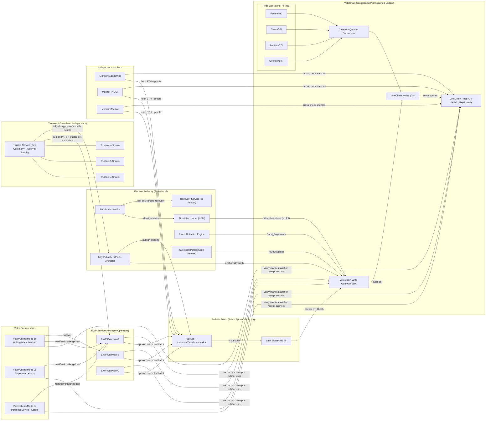

# VoteChain Production Architecture (Servers, Trust Boundaries, and Why)

This page maps the production alignment for the complete system:

- **VoteChain** (verification + fraud review evidence layer)
- **EWP** (cast-to-tally ballot integrity layer)

It focuses on "what runs where" and "why", and is written to be concrete enough to critique.

Notes:

- **Mode 1 (in-person)** and **Mode 2 (supervised)** are the primary targets for early pilots.
- **Mode 3 (unsupervised remote)** is explicitly gated and should not be treated as a default.

## 1. Two Planes (Minimize Correlation)

Production separates the system into two logical planes:

- **Eligibility / verification plane (VoteChain):** eligibility ZK proofs, nullifier uniqueness, revocations, fraud flags, audit anchors.
- **Ballot content plane (EWP):** encrypted ballots, public bulletin board, non-equivocation monitoring, threshold decryption, tally proofs.

They are linked only by **audit anchors** (hashes/commitments), not by voter identity or ballot plaintext.

## 2. Operator Categories (Who Runs What)

These are the distinct operator categories the architecture assumes:

- **Election authority (state/local):** enrollment operations, voter services, election definition, gateways (some or all), incident response.
- **VoteChain consortium:** permissioned ledger operators (federal + state + auditor + oversight categories) and supporting read APIs.
- **Independent trustees/guardians:** hold threshold key shares; participate in key ceremony and tally decryption/proof publication.
- **Independent monitors:** continuously fetch BB checkpoints and VoteChain anchors; detect equivocation and suppression.
- **External data sources (government feeds):** SSA/vital records/USCIS/passport feeds used at enrollment and for post-enrollment revocation signals.

## 3. Production Component Map (The Servers)

The minimal production build (Mode 1/2 pilot) includes the following server-side components.
Names are descriptive; implementations can vary as long as the interfaces and invariants are preserved.

- `enrollment-service`
  - Where: state enrollment offices (DMV/SSA partner desks, county offices, mobile units).
  - Why: identity proofing and recovery are operational processes, not internet flows.

- `attestation-issuer`
  - Where: election authority secured environment, HSM-backed signing keys.
  - Why: produces signed attestations for the five verification pillars without storing PII on-chain.

- `recovery-service`
  - Where: enrollment offices; in-person only for early phases.
  - Why: handles lost device/card scenarios via identity re-verification + Shamir recovery governance.

- `fraud-detection-engine`
  - Where: election authority secured analytics environment.
  - Why: ingests external signals (death/judicial/move patterns), emits `fraud_flag` events, routes cases.

- `oversight-portal`
  - Where: election authority + oversight team environment (role-gated).
  - Why: case management, evidence bundles, reviewer actions, and audit exports.

- `votechain-ledger` (permissioned network)
  - Where: 74 permissioned nodes operated across categories (Federal 6, State 50, Auditor 12, Oversight 6), using a category-quorum consensus policy.
  - Why: no single party can unilaterally rewrite or suppress verification or audit anchors.

- `votechain-read-api`
  - Where: multiple operators; cached and distributed.
  - Why: lets clients/monitors verify anchors without trusting a single gateway.

- `ewp-gateway` (multiple operators)
  - Where: at least two operator categories; geographically redundant.
  - Why: availability and anti-disenfranchisement; no single gateway is a single point of failure.

- `bb-log` (public bulletin board)
  - Where: publicly reachable service; can be multi-operator or replicated; append-only.
  - Why: transparency log for encrypted ballots and election artifacts.

- `bb-sth-signer` (STH signing service)
  - Where: HSM-backed key service operated by the BB operator(s).
  - Why: signs checkpoints (STHs) so equivocation is detectable when monitors compare and verify anchors.

- `monitor` (independent)
  - Where: run by independent parties (academic/NGO/media/government).
  - Why: detects inconsistent BB views (equivocation), missing anchors, and suppression attempts.

- `trustee-service`
  - Where: used by trustees/guardians (often on dedicated hardware/HSM environments).
  - Why: supports key ceremony, partial decryptions, and publication of decryption/shuffle proofs at tally.

- `tally-publisher`
  - Where: election authority public publication service.
  - Why: publishes the final tally artifact and the proof bundle; anchors the tally hash to VoteChain.

## 4. Alignment Diagram (Production Ownership + Data Paths)

## 5. Why These Pieces Live Where They Do

This alignment is designed to satisfy the core claims without adding new "trust me" gaps:

- **No single point can silently alter outcomes**
  - Multiple gateways, independent monitors, append-only BB, and VoteChain anchors.

- **No single operator can decrypt individual ballots**
  - Threshold trustees hold shares; decryption occurs at tally with published proofs.

- **Clients do not have to trust a gateway**
  - Manifest and anchors are cross-checked via VoteChain read APIs.

- **Non-equivocation is externally detectable**
  - BB checkpoints are signed and anchored; monitors compare views and demand consistency proofs.

- **Operations stay inside existing election legal guardrails**
  - Identity proofing and recovery remain in-person processes for early phases.
  - Flagged cases route to provisional handling and auditable reviewer workflows.

## 6. "What Is Public" vs "What Is Private"

Public artifacts (everyone can fetch and archive):

- Election manifest + signing keys (or their identifiers) and VoteChain manifest anchors
- BB leaves (encrypted ballots) + STH history + inclusion/consistency proofs
- Cast receipts (do not reveal vote selections)
- Tally artifact + proof bundle + VoteChain tally anchors

Private / restricted artifacts (role-gated, never on-chain):

- Enrollment PII and identity verification evidence
- Fraud investigation case files containing sensitive evidence
- Trustee private shares and HSM internals
